# Apps for Mac

\

## Specimen 1: Blogo

Blair Donovan

\

* **Use**: Wordpress-synced blogging
* **Cost**: $29.99
* **Developer**: Gisele Goes, Ivan Neto, Amure Pinho, Renan Protector, and Gabriel Vincent
* [Website](http://getblogo.com/)

### Basic Knowledge

Blogo is an app for bloggers. It connects directly to WordPress and gives bloggers access to everything they’ll need to make a post. Although available only to Macs, Blogo makes blogging fast and easy. Blogo debuted in 2008, but it has updated several times since its previous version. Apple deemed Blogo as “Best New App,” and Evernote chose Blogo as one of the “Best New Startups of 2014.”

\

### Characteristics

Blogo essentially replaces WordPress and allows bloggers to post from the app itself. 

* **WordPress connection**: Blogo can post and save blogs directly to WordPress without getting on the website. This offers the ability to write on the app while offline and post the blog when the user is back online.
* **Evernote connection**: Blogo syncs with Evernote, a note-taking, workspace app. 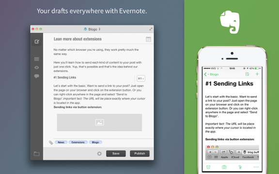\
* **Multiple blogs, one dashboard**: The app allows users to connect with multiple WordPress accounts at once.
* **Image editor**: Complete with filters, cropping tools, and brightness and contrast adjustment, users have some control over image editing tools. 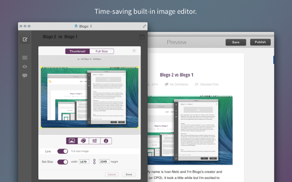\
* **Comments**: Feedback from other users is organized and displayed in one place. 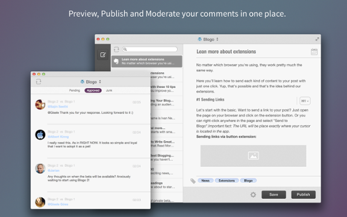\
* **Preview**: The user is able to view a blog post before it is finalized.
* **Scheduling**: The user can organize drafts to be posted in the future.
* **Archive**: All previous blog posts are organized and viewable.

### Adaptations

On WordPress, images can be centered, put to the left, or put to the right. With Blogo, the image can go anywhere with one simple drag. Images can also be dragged directly into the app from the desktop. On WordPress, the process of adding an image requires saving the image to the desktop and uploading it to the website. Blogo even includes a feature that allows users to embed videos and photos from external websites into a blog post—web browsers include a “send to Blogo” button, automatically sending the photo or video into the post.

Bloggers have the ability to schedule a post for the future. The right corner of the app has a calendar where the user can choose a date and time for a post in the future. The app will then automatically post the draft to WordPress at the scheduled time. It even has the ability to make the app full screen, making it easy to write blog posts free of distractions. Blogo has most of the features that WordPress does, but they’re much more conveniently located and easy to use. On WordPress, the buttons are scattered around the page, making it difficult to quickly create a blog post. With Blogo, buttons are all located in view on the left-hand side and at the bottom of the app. The left-hand side features buttons to create a new post, preview a post, hide or show a list of all previous posts, view all comments on posts, and to open a media file from the desktop.

The buttons to edit the text are easily accessed as well. To edit a piece of text, select it and double click. A toolbar will appear with the option to bold, italicize, underline, or strike through the selected text. It also has the options of making the text a bulleted list, inserting a hyperlink, making the text a block quote, or making it a heading. The same is true for photo editing. Once a photo is inserted into the post, the photo editor immediately appears, allowing users to edit photos without going to an external app or website. These tools are useful because they are much more organized and easy to find compared to WordPress. This allows users to edit their text and photos much faster than if they were on WordPress.

### Vulnerabilities

The app has many valuable assets, but also a few drawbacks. One drawback is that images in Blogo appear as thumbnails. Only when bloggers publish the post will the images be visible on WordPress. The app also lacks a few valuable WordPress tools, such as word count, an option to view the HTML of the post, and a proofreader. Also, bloggers outside of WordPress or those with Windows cannot use the app. However, according to the Blogo website, the app will soon be in collaboration with Tumblr and Blogger.

Also, posts created while offline do not automatically post when the user is back online. A blogger would have to manually post the blog when he or she has Internet access. It would be beneficial and less time-consuming if the app automatically posted blogs for users once the Internet connection is reached.

### Compatibility

Blogo appeals to bloggers who use WordPress because it essentially replaces the online form and it has features that WordPress lacks. Blogo is perfect for WordPress bloggers who frequently blog on-the-go, especially because of the ability to type without being online. It’s also useful for those who want to speed up their blog-posting process. Blogo is great for bloggers who post photos often. The app eliminates the need to use Photoshop or any other photo editing tool, making posting photos much faster and easier. Also, Blogo is the perfect app for anyone who juggles multiple blogs. The app organizes the posts and comments of multiple blogs at once and makes it easy to switch back and forth between them because of its organization and simple design. Blogo would be perfect for beginner bloggers because of its simplicity and fantastic features all in one place.

### Observed In The Wild By:

Blair Donovan has a double major in Journalism and Professional Writing. She recently started blogging for UP fashion magazine's online blog at Miami, and spent her summer as an intern writing articles for a healthcare company.

## Specimen 2: Byword

Emily Thieman

\

* **Use:** Transferring and working on projects from device to device
* **Cost:** $9.99
* **Developer:** Metaclassy
* [Website](http://bywordapp.com/)

### Basic Knowledge

Byword is a writing application that can be used on any Apple device. Its simple design encourages users to focus on writing, and its accessibility allows users to work with Byword from multiple devices. The newest edition of Byword requires iOS 8 or higher for iPhone, iPad, and iPod, or OS X Mountain Lion (10.8) for Mac. With a number of features and benefits, Byword is an ideal app for a number of users.

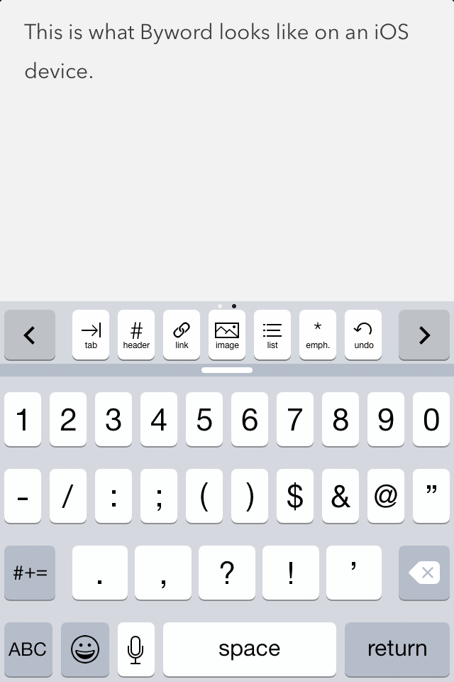\

### Characteristics

Most significantly, Byword offers:

* **Keyboard shortcuts**: Users can access important formatting and editing tools through a series of keys at the top of the keyboard, including the tab key, heading and emphasis keys, a URL link key, image key, list key, and undo key. These basic and necessary functions of text formatting help users create a cohesive text document without leaving their tablet or mobile device.
* **Autocorrect**: On the iPhone, Byword utilizes the autocorrect function of the keyboard. In the same way texts are clarified (for the most part) with automatic corrections, Byword users need not fret over the small keys on an iPhone to craft their text.
* **Publishing**: The most recent edition of Byword allows users to automatically publish their work to their blog. By syncing Byword to a user’s WordPress, Tumblr, Scriptogram, or Evernote account, the application provides easy access to multiple publishing platforms.
* **Markdown**: Presented in rich text, Byword can be transferred to a plain text format. Essentially, users can write in standard text and easily convert it to HTML.

### Adaptations

The simplicity of the text contributes to the beauty of the program. Byword is presented on a white background with charcoal text, but users can change the font if desired.

For users with only basic technological capabilities, Byword is still easy to understand. The keyboard and exporting functions are straightforward and require little background knowledge of rich and plain text differences. Moreover, an easily accessible word count is available by swiping the row of keyboard functions on iPhone, iPad, and iPod.

### Vulnerabilities

While the application is generally very user-friendly, there are a handful of minor inconveniences that detract from the program. For example, when working with iOS on an iPhone, the first letter in a sentence is automatically capitalized in almost every instance, but not at the start of a new paragraph. Users with strong typeface preferences may also find Byword’s font options limiting.

Another shortcoming is Byword’s limited emailing capabilities. Users can email themselves the text they’ve written, but they cannot do it as an attached Microsoft Word document. The text must be sent in the content of the email, as an attached PDF document, or as attached HTML text. While this is the inherent weakness of using a non-Microsoft Word application, there are still many writers who prefer to receive documents as an editable attachment in an email, not as email content or as a PDF.

### Compatibility

Multi-device Apple users will appreciate the transferability between devices. Users can export from iCloud, making documents easily available from iPhone to MacBook to iPad. Because of its transferability, Byword is ideal for students who procrastinate. While pulling out a laptop in the middle of class to finish an assignment due in the next is quite conspicuous, doing so on an iPhone is far less noticeable.

### Observed In The Wild By:

Emily Thieman is majoring in secondary English education, and will be student teaching this spring. Therefore, she specializes in writing expository essays and literary analyses, but also dabbles in emotionally-driven journaling and villanelle writing. 

## Specimen 3: Day One

Erin Antonelli

\

* **Use:** Journaling
* **Cost:** $9.99 (computers), $4.99 (iPad/iPhone), or $20.00 (all devices)
* **Developer:** Paul Mayne
* [Website](http://dayoneapp.com/)

### Basic Knowledge

Day One is an app available for Macs, iPhones, and iPads. The app’s purpose is to make journaling a positive experience that can be achieved through technology. It utilizes many elements that traditional journaling cannot; for example, it publishes journals through social media including digital pictures. The Day One app experience is mainly positive. It is easy to incorporate into daily life and provides a nice outlet for thoughts and ideas. Since its release in 2009 the app has grown tremendously and the app’s creators are continuing to work on improving and adding features. The app has recently been recognized for its design; it is an Apple Design Award Winner for 2014.

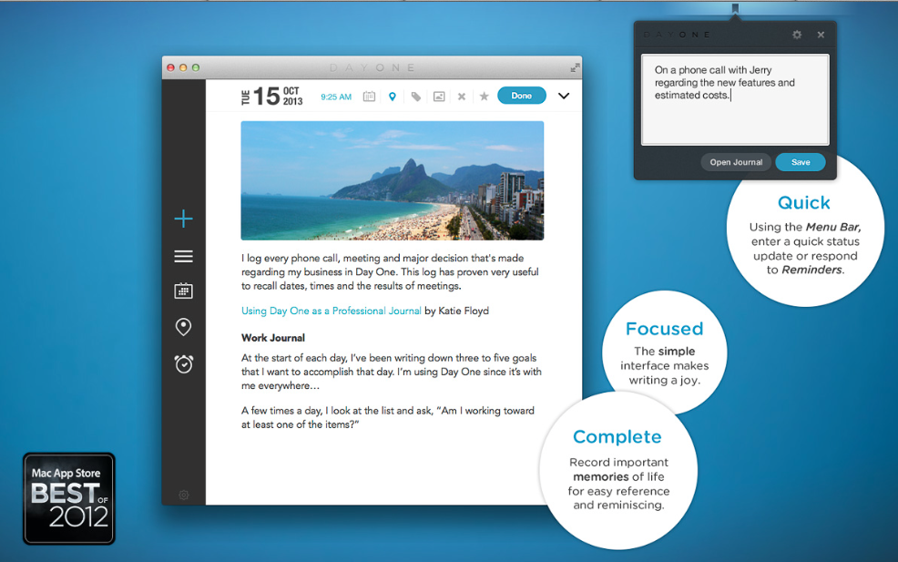\

### Characteristics

* **Usability and interface:** Day One has a clean, distraction-free interface so that users can remain focused on the task at hand; users also have access to a full screen mode, a privacy passcode lock, a quick entry window in the Menu bar (Mac version), and multi-Markdown text formatting.
* **Photo-friendly:** Users can upload entire photographic entries.
* **Automatic Tracking:** Each Day One entry automatically tracks the time and date, the location, and temperature and weather conditions the writer was experiencing as they wrote their piece. The app also tracks the music that was playing, motion and step count (iPhone version), and photo EXIF data.
* **Encouragement:** Day One offers users customized writing reminders and inspirational quotes and questions to keep the writer motivated.
* **Organization:**  Day One allows users to search by keywords, create hashtags, star favorite entries, and browse through past entries by calendar, timeline, maps and more. 
* **Archive and Backup:** Users can sync their entries across all of their Mac devices through Dropbox or iCloud (iOS sync with purchase of iOS app). Day One also automatically backs up information periodically. 
* **Sharing:** Users can print and export their entries into a PDF format. Users can also tweet entries, check-in with Foursquare (iOS version), and email entries via PDF, HTML, or Plain Text format.

### Adaptations

The app excels in many areas. One specific area being motivation, the app engages users and makes them want to use the app. This provides the user with prompting questions, such as, "what did your parents do that you are most proud of?" and inspirational messages such as, "keep a diary, and someday it’ll keep you," a Mae West quote. The prompting questions and inspirational messages allow the user to be motivated because it provides a topic for them and a reason to keep writing. Since the app is on multiple devices it is easy for users to access the app and use it regularly. For example, a user might take a photo of an animal at the zoo and quickly add it to the journal entry written this morning on the computer about the excitement of going to the zoo. 

The app has a reminder to motivate users to journal and use the app. The reminder can be set to a certain time or a certain length; for example, it can remind a user to journal every day at 9:00 am. Also, the app has the ability to search through old entries. Days, weeks, and months can often blur together making it hard to remember what day an old journal entry was written. With the search bar the user is able to search through older journal entries for certain topics. It also keeps track of the weather and music so the user can get a feel for the sense of the writing setting when the journal was written. Lastly, the user has the ability to share journals; journals can be shared through Twitter, Facebook, or exported as a PDF.

### Vulnerabilities

Along with its strengths the app also has several weaknesses. One of these is encryption. The app offers a password for access, but adding encryption of the Day One files would allow for more security. Also, adding multiple photos to an entry is difficult. Currently, the app has the ability to add only one photo at a time. This means if the user wishes to have more than one photo documented for the day, another entry must be created. Plus, there is no way to add video to the entries, which could enhance the app’s ability to help users remember their days through journaling. 

On the iPhone version, the music the user is listening to can be added to the journal entry. However, it has to be through the music app supplied by Apple and cannot be through other music applications. Finally, the user can not make more than one journal entry per day; however, the Day One website addresses this issue and provides a “hack” to have more than one journal.

### Compatibility

There are a wide variety of users that Day One can reach. This app would be especially useful to those who already journal using traditional pen and paper. Making the transition to online journaling would be easy, because these users are already used to writing down their thoughts and ideas. Day One adds a new dimension to journaling, because of its use of multi-media. Journaling, however, is easy to learn and can be beneficial to daily life for anyone. Therefore, this app would be well suited for anyone that wants to track their daily thoughts and actions. This could be especially important for people who are traveling such as students studying abroad. The app has the ability to share on social media, giving students the opportunity to share their memories with their friends and families. This app could also be useful to professionals that want to keep a log of specific information. For instance, this app would be helpful for a relator to remember clients and information about the houses they looked at.

### Observed In The Wild By:

Erin Antonelli is a double major in Strategic Communication and Professional Writing. She enjoys dancing, journaling, and baking delicious cookies.

## Specimen 4: Mou

Alexis Glowka

\

- **Use:** Writing web text
- **Cost:** Free
- **Developer:** Chen Lou
- [Website](http://25.io/mou/)

### Basic Knowledge

Mou is a relatively new app designed by Chen Lou. Essentially, Mou is a Markdown editor that helps authors write HTML in an easier and faster method. Markdown, created by John Gruber in 2004, is a system of shortcuts that allows the user to skip the arduous—and sometimes tricky—task of entering in each and every bracket, code, and symbol. For example, instead of writing \<H1\> before the header, the developer would simply write a hash character (#). If necessary, Markdown text can later be converted into HTML with no work on the user’s part, as the app does it automatically. With Mou, there’s no need to worry about a missing bracket or a forgotten tag; Mou color codes its symbols and offers a split screen view so users can always directly see the results of their actions. 

\

Mou is incredibly simple to use and easy to learn. It’s specifically designed for Mac OS X and must be downloaded on to the computer to be used.

### Characteristics

- **Split screen live preview:** Users have the ability to preview the content side-by-side as the code is written.
- **Autosave:** Mou automatically saves users' work so they don’t have to!
- **Sync scroll:** The split screens sync together as the user scrolls through their content.
- **Custom themes and CSS:** Users can customize Mou’s interface to suit their preferences.
- **HTML and PDF export:** Mou offers its users already made HTML and PDF formats of their work to post on to other sites and platforms.
- **Enhanced support:** Japanese, Chinese, and Korean characters are fully supported on Mou’s interface.
- **Incremental search with pattern matching:** Mou tracks the user's content.
- **Auto completion:** Words in English are automatically completed.
- **Word counter:** Mou keeps track of the character amount so the user doesn't have to. 
- **Posting:** Users have the ability to directly post onto Tumblr or Scriptogr.am. \
- **Access to GitHub:** PDF links to GitHub are available. 

### Adaptations

Mou has many strengths that make it applicable to web developers. First things first: it’s incredibly user friendly and easy to understand. The Markdown syntax isn't too difficult to learn in itself, but Mou makes it even easier by color-coding the Markdown and offering a split screen view so that developers always know what they’re doing. Mou also autosaves so users will never have to worry about accidentally closing the window and losing their progress. No worries—Mou already took care of it.

Mou offers the opportunity to write in other non-Latin based languages such as Chinese, Japanese, and Korean. There’s even a screen converter so that the developer can write the characters vertically, making the process even easier for developers writing in these languages. For users that are working in these languages, Mou offers them additional support in case they do run across problems. Additionally, in case any user runs across problems, the app has a help search bar, a link to the website for further information, and an email address to contact Mou’s developers.

Another benefit of working in Mou is that once the user is done with the document, they can export the finished product as a PDF file or convert it into standard HTML. These then can be opened in GitHub or sent to other social media sites on the web. For instance, the app offers the choice to post documents directly from the user’s device to blogs such as Scriptogr.am or Tumblr. Both processes go through the user’s email account and are extremely easy and quick to do.

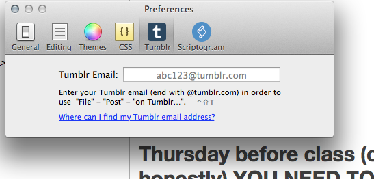\

In addition, the app corrects spelling and grammar, which can be checked automatically or done manually depending on the user’s preferences. There is an option to have Mou read the document’s text back to the developer, as well as an option to dictate the document using the computer’s microphone. And just in case the user is feeling particularly emotional or expressive, there is even an option to insert the standard Apple emojis.

### Vulnerabilities

Mou is currently in its beta version, so there is still a lot of room for improvement. While this means that Mou does have some weaknesses, it also means that users get the chance to communicate with Mou’s developers and suggest improvements.

Currently, the directions to Mou and its Markdown are located on the website instead of on the downloaded program. Because of this, it felt like the user should already know how to write in Markdown. In any case, there is a link to the website and the directions are located there. If the user for some reason didn't learn Markdown, there is an option in the app for the Markdown to be automatically inserted. For instance, under the "actions" menu in the toolbar, Mou has options to insert the Markdown for bold or italic words. To make it even easier, there is another option under the "actions" menu that allows users to convert their typed text from H1 to H3s, or to make block quotes and lists. So even if the user doesn't understand Markdown, the product can still be used.

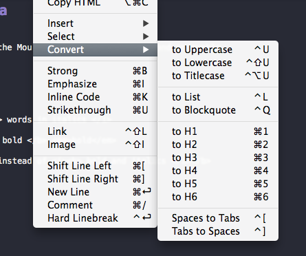\

### Compatibility

While Mou was designed as an easy and quick tool for web developers, it’s also a great tool for those who are not familiar with working in HTML and CSS or who don’t feel entirely comfortable working in them. As HTML and CSS can be quite tricky for newcomers, Mou would be the perfect platform for newbies to utilize and understand the basics of working with web text. For these reasons, Mou could be used in the classroom, as the setup for a business website, or for those interested in designing their own web texts.

### Observed In The Wild By:

Alexis Glowka is a Professional Writing major and Spanish minor. She aims to eventually work for a non-profit organization, cure her coffee addiction, and own her very own pack of Alpacas.

## Specimen 5: StoryMill
Alexandria Moore

\

- **Use:** Novel or memoir writing
- **Cost:** $49.95 for standard program (+$24.95 for upgrade)
- **Developer:** Mariner Software
- [Website](https://marinersoftware.deskpro.com/new-ticket)

### Basic Knowledge

StoryMill, developed by Mariner Software, is a writing platform designed to fit the specific needs of the novel writer’s experience. Described as “part word processor, part database,” the program condenses the stages of research, scene writing, and editing, allowing the user to control all elements and programs through one processor.

The central metaphor that the creators of StoryMill use to describe their method is the scene-centric model. Stories are built from small moments, which rarely develop chronologically or fully-formed. StoryMill encourages users to build scenes freely at moments of inspiration and flesh them out later. The user can organize and rearrange scenes freely among chapters, and use drafting, annotation, and task-making to form a cohesive novel.

### Characteristics

- **Annotating:** This feature allows the user to hyperlink text within the program so that embedded information—notes, references, pictures, or comments—can be viewed in a separate pop-up window.
- **Color-Coding:** This system labels each file according to progress, ranging from first draft to final, and includes editorial tabs such as “needs work.”
- **Highlight Clichés:** StoryMill identifies commonly overused phrases and highlights them, allowing the user to edit or remove according to their discretion. \
- **Progress Meter:** Perhaps the most impressive of StoryMill’s features, this tool allows the user to set goals both within the current session and the project as a whole. Positioned in the center of the toolbar, the meter gives the user the ability to freely adjust how their progress is measured. Options include measuring by word count, page count, and time (in minutes). The bar fills according to the percentage of progress in real-time, and announces when the user has reached their goal with an unobtrusive alert sound, for which there are 14 options. 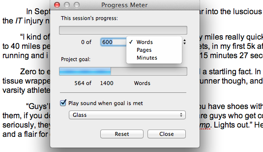\
- **Snapshots:** This feature ensures that a quick backup of any window is available. The user is also able to align a snapshot next to another copy of the same section so that any changes made aren’t lost.
- **Timeline:** The user can establish a timeline for their progress, or view the calendar according to the date and time of a scene’s creation.
- **Window Fade:** With this feature, the user is able to stack the StoryMill screen over their internet browser or another document and adjust the StoryMill window’s transparency down so that the text of the window beneath it will be visible.
- **Word Frequency:** This comprehensive search feature allows the user to scan the entire project for a word or phrase, annotating or replacing as needed.

### Adaptations

The comprehensive user’s guide is a quick and easy way to master the program and take full advantage of what may otherwise be an overwhelming learning curve (particularly for those who aren’t comfortable with technology). If that is more effort than the user chooses to exert, StoryMill opens with a friendly tutorial starring the symbolic “Three Little Pigs;” the intelligent Brick pig explains to his duller brothers the many uses and tricks of StoryMill, while employing the various features in the text.

Organization is the cornerstone of StoryMill’s functionality. Specialized features such as snapshots and the timeline aim to remove some of the greatest banes of the writing process: fear of losing drafts and losing one’s place within the work. The user has the ability to organize the scenes according to location to give the setting a better sense of structure and clarity, or develop characters and set them aside for later with folders just for that purpose.

Ultimately, the developer hopes that users will consider StoryMill to be just one facet of their entire Writer Suite, which would cost around the same as Microsoft Office. The suite would serve as an asset for writers, but it also requires sacrificing additional program capabilities such as data and slideshow programs. However, there are alternative browser-based office suites that offer such programs for free, while the Mariner Suite offers a specialized spread of features that won’t be found elsewhere.

### Vulnerabilities

This word processor isn’t designed to replace a standard program like Microsoft Word. It is a specialized platform meant to meet the needs of novel writing, and therefore is tailored to a highly specific writing process. Features that are well suited for novel writing—tabs for character, scenes, etc.—merely clog the writing environment for academic and poetic projects.

StoryMill is not compatible with standard word processors like Microsoft Word, meaning that a final draft of the novel will require reformatting to fit standard readability. The manual gives step-by-step instructions on how to format, but there is always room for error.

The organization of multiple projects requires individual windows, cluttering the Mac’s desktop and making it too easy to forget which project the user is working on. In the same vein, there is no full-screen feature (although the distraction-free mode simulates this), meaning that using the standard multi-feature fits only as well as the user adjusts it, and the screen hovers above the dashboard.

There are features that are, in theory, clever and useful to the writing process, but fall short in application. Perhaps the best example of this is the “highlight cliché” feature. The feature sometimes fails to recognize some of the most overused clichés while catching others that might be considered negligible.

Perhaps the greatest disappointment is StoryMill’s lack of storyboarding/plotting capabilities. The Tasks function is designed to be a catch-all, highly customizable tool for developing extraneous elements that don’t fall under the main spectrum of features. The “pin board” option that is often prevalent in writing programs is absent here, making way for another Mariner program called Contour, which would run the user another $49.95.

### Compatibility

StoryMill was developed specifically for novel writing—the process of plot, world, and character building. It has many useful organizational tools—such as the Tasks, Research, Outline, and Annotate features—that are universally useful in the writing process, but ultimately, StoryMill is best used in conjunction with another platform such as Microsoft Word or Google Docs. Poets will find it of little use, with a general project organization that favors novels and a distracting layout that does not match conventional page format. It does offer a “distraction-free” mode, but this option would likely interrupt normal line breaks between full-screen and print view.

Still, novel writers aren’t the only users who might enjoy the program; for users writing narrative nonfiction—memoir, biographies and the like—StoryMill offers a unique organizational toolkit. Thanks to the character, location, and timeline features, nonfiction writers can compile vast and varied research content. The Tasks option is also universally beneficial, serving as a highly customizable template to manage extraneous aspects of the creative process, whether they are specific in nature or simply unique to the writer.

### Observed In The Wild By:

Alexandria Moore is a Professional Writing and Journalism double major. Her spare time goes towards reading, writing, and photography. It is her dream to work in publishing in a land far, far away from the Midwest.

## Specimen 6: Ulysses III
Katie Zak

\

- **Use:** Focused writing
- **Cost:** $44.99
- **Developer:** The Soulmen GbR
- [Website](http://ulysseysapp.com/)

### Basic Knowledge

Ulysses (or Ulysses III) is a premier plain text editor for Macs. A demo version is available for ten hours of real use, and after the time is up, read-only mode is activated. Once the trial is over, texts can still be transferred to the real version of the app.

### Characteristics

- **Appearance:** Ulysses is a clean workspace with final, polished publishing capabilities. Its basic layout uses a three-pane setup: side bar, sheet list, and editor (from left to right), with the optional addition of a markup bar. Ulysses encourages customization and aims to create the most comfortable environment for every user. The screen can be altered and diminished to a one- or two-pane set-up depending on the user’s preference; the screen can even be switched into “dark mode” if the user prefers a black background with white text for energy-saving night work. With only the editor pane showing, there are no distractions. 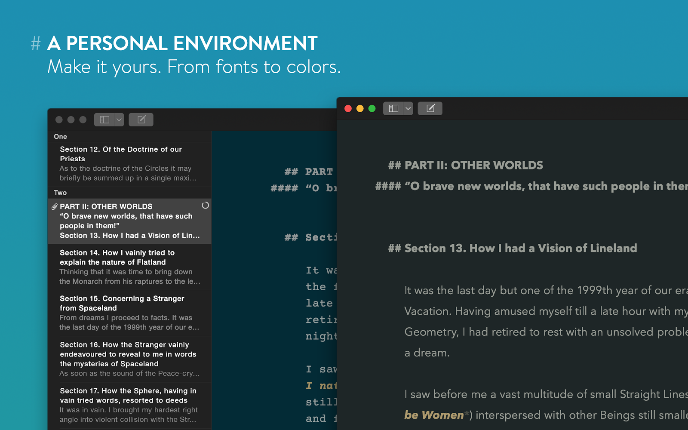\
- **Markdown:** Instead of tabs and icons (layout tasks) to change headings or bold/italicize words, Ulysses uses the Markdown syntax. These are quick, typed shortcuts that change the text on command. Through Markdown, users can add links or comments to the text. Headings are changed on a scale of 1-6, paragraphs or thoughts can be divided, and annotations, images, and other extra features can be inserted into the text. Users can also change tag colors, text and background colors, and accent colors through the Markup tab within Preferences. 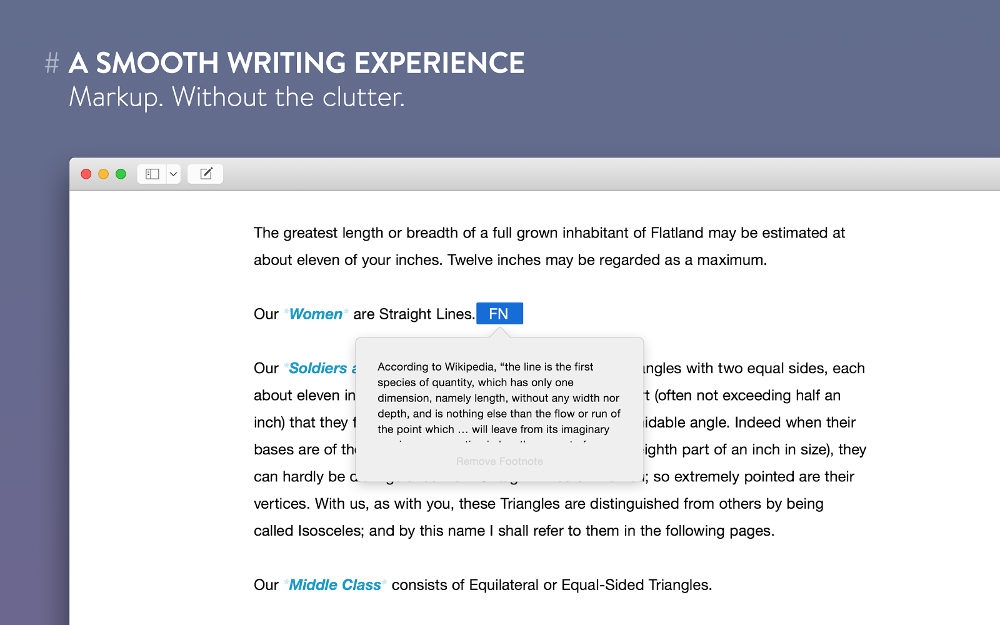\
- **Export:** Ulysses can export files in multiple styles and formats. Documents, called “sheets,” are easily stored to iCloud or the user’s computer and can be exported in PDF, Microsoft Word document, HTML, or EPUB form. 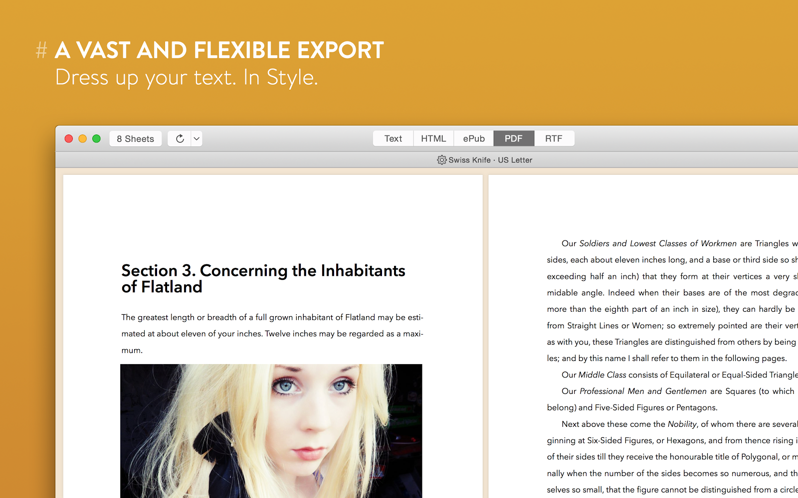\
- **Themes:** Users can build their own themes, and these themes can be published on the “Style Exchange” page of the Ulysses website. Featured user-made styles or themes can be downloaded and used in other users’ work. This open source feature adds a creative initiative to share unique formatting ideas with others. Sheets created on Ulysses can be exported to other apps or publishing platforms, and they can also be exported and opened in iBooks.
- **Statistics:** Ulysses features character and word counts, and users can even set goals for themselves for words written within a certain time period. This is an effective productivity tool and motivator for writers working on a deadline. 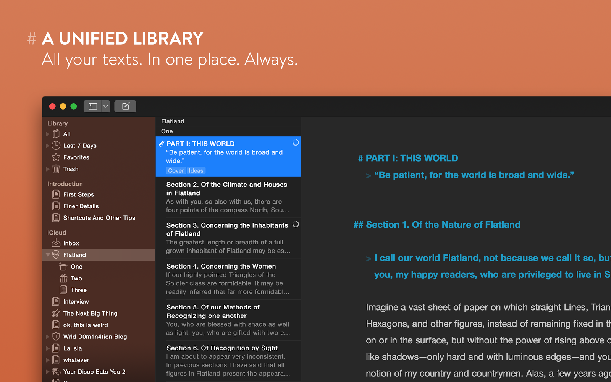\

### Adaptations

Ulysses has many strengths: most notably its uncluttered design, simple markup, and easy exporting. It’s a writing space ideal for focusing; the single pane option removes all distraction and leaves the user with open space to concentrate solely on work. The use of Markdown instead of tabs and icons on a toolbar frees the user’s screen of the potential temptation to fidget and procrastinate by looking at different formatting options. Tools such as spell check and grammar check are available to users, in addition to dictation capabilities. Organizing sheets is easy and clutter-free; searchable folders and groups can be created. Ulysses has iCloud saving capability, but there is also an option to save files anywhere on the user’s computer. Ulysses is available in multiple languages: English, French, German, Italian, Japanese, Simplified Chinese, and Spanish.

### Vulnerabilities

Ulysses does not have many apparent weaknesses, but one big complaint from users is its exclusive Mac availability. It has the iPad-compatible counterpart of Daedalus Touch, also created by The Soulmen GbR, but both apps are only available for use on Apple products.

### Compatibility

Ulysses is whatever the user makes it; it’s a useful app for any type of writing, but it’s especially beneficial for lengthy writing tasks. Its versatility makes it easy to create anything from menial writing tasks, such as lists or notes, to large-scale projects such as lesson plans or novels. Ulysses is designed to help writers focus on their words, and it accomplishes just that.

### Observed In The Wild By:

Katie Zak is a Literature major. She enjoys reading, yoga, and occasionally contributing articles to Thought Catalog under a pseudonym.

