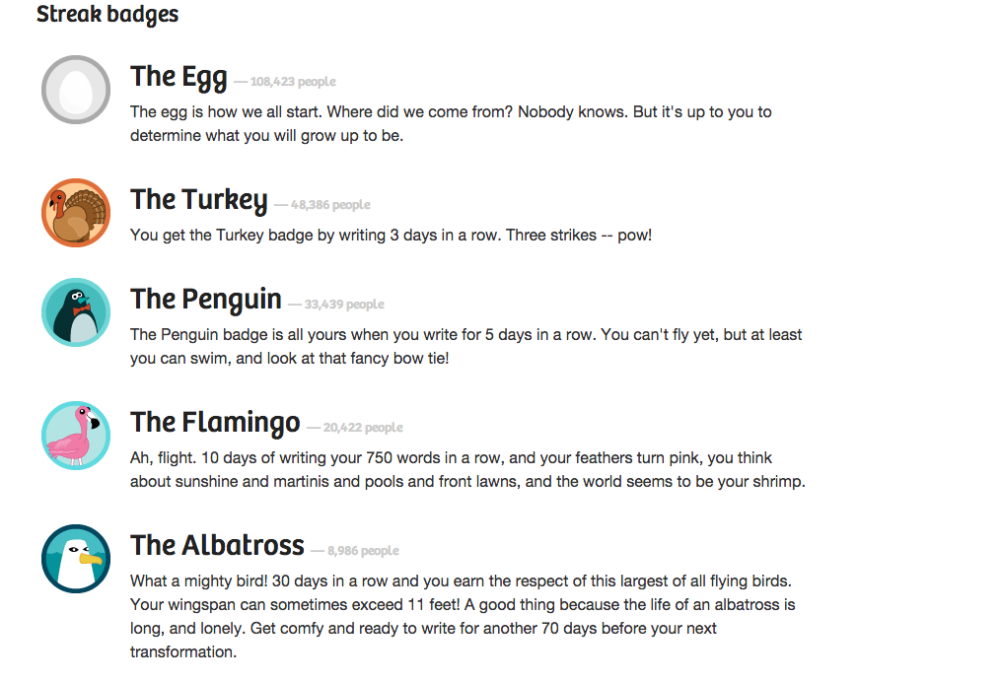
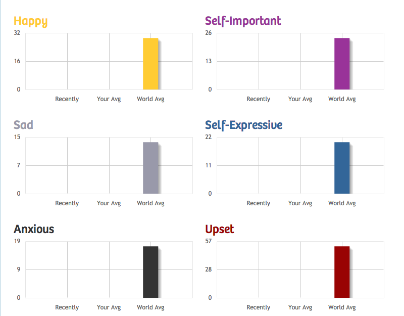
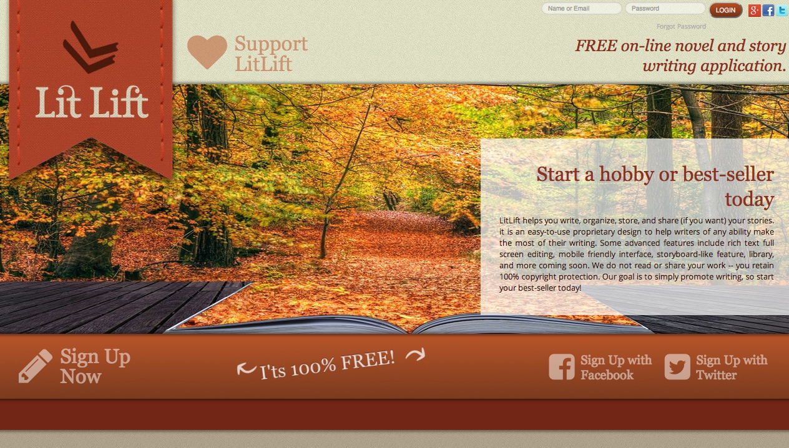
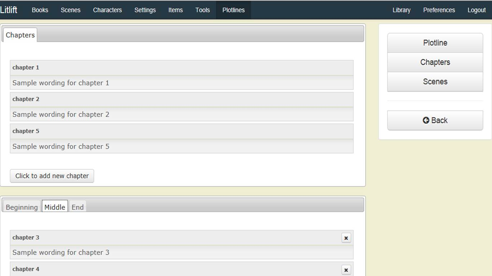
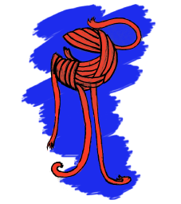
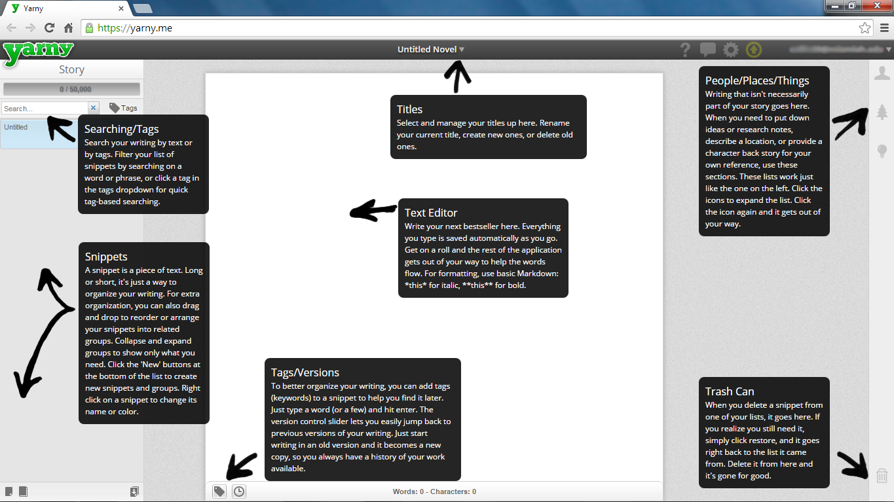
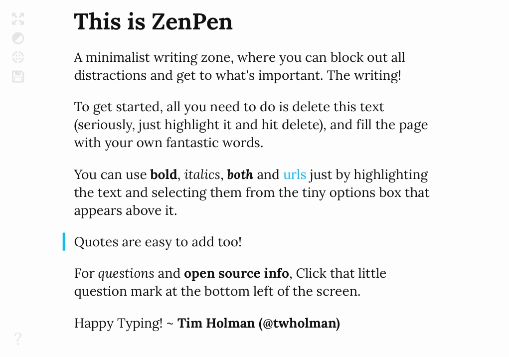
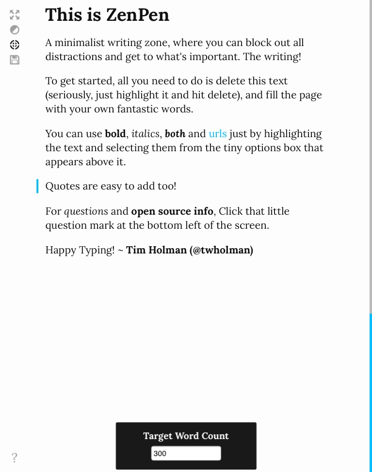
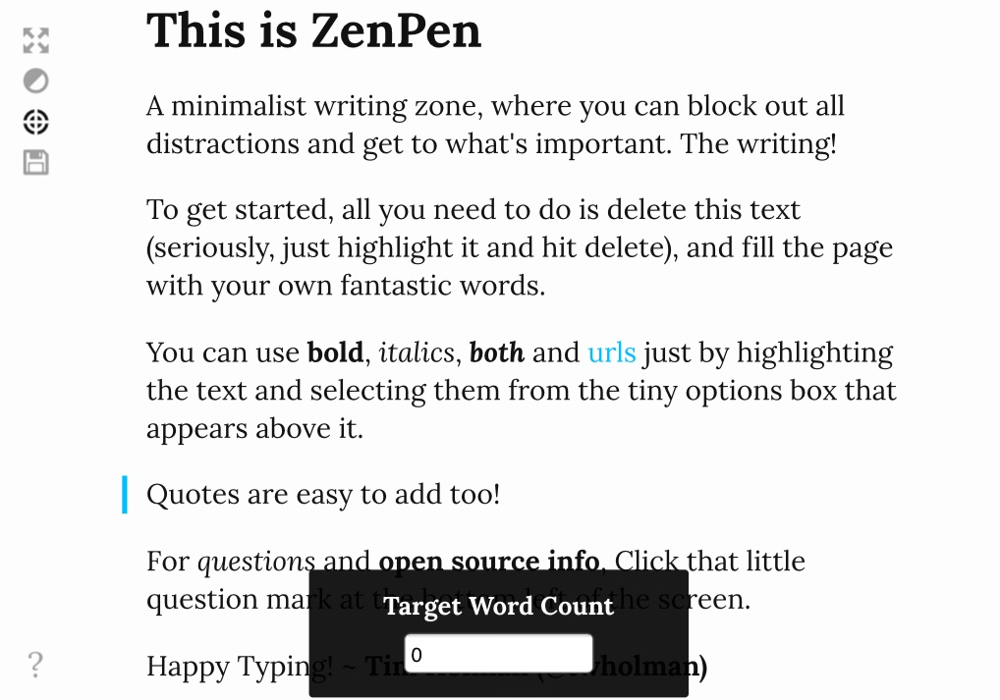
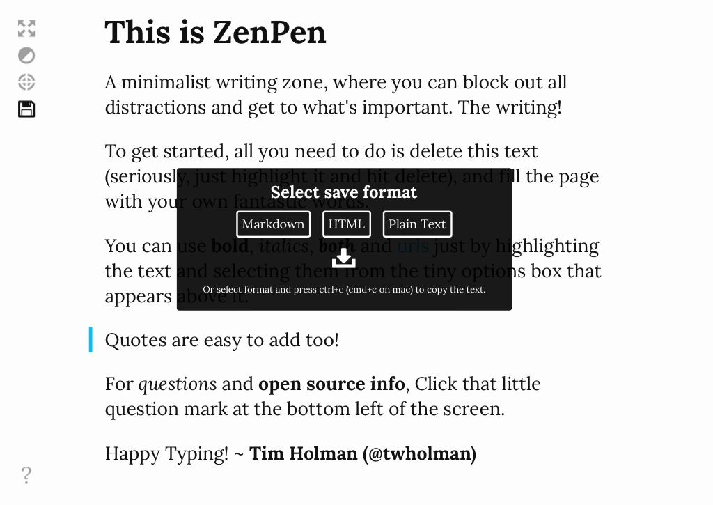

# Apps for Web

\

## Specimen 1: 750 Words

Alexandra DeCraene

\

- **Use:** Freewriting, writing prompts, short works
- **Cost:** $5 per month
- **Developer:** Buster Benson
- **Contact:** [750 Words Website](http://750words.com/)

### Basic Knowledge

750 Words is an app designed to be a “brain dump.” The creator was inspired by advice he was given to write three pages a day as a way to clear his mind. This writing does not need to be edited, censored, or even structured. The goal is to free up the space that the writing occupied in the user’s mind. This is different than a blog, as it remains private to the user. The name “750 Words” comes from the three-pages-a-day writing goal the creator had when conceiving the app.

### Characteristics

- **Interface:** This app features a white blank space free of distractions. The interface is very simple and clean.
- **Autosaving:** The app autosaves all writing.
- **Evaluation:** More fun features include an auto-scrolling screen and an interactive point system. The user gets points for completing word count goals or writing for a consecutive number of days.
- **Privacy:** Other users can see each other’s performance so they can "compete" with friends, but the writing remains completely private.
- **Motivation:** The program also has fun badges, which are highly motivating and somewhat interactive. Users can earn badges for milestones such as week-long streaks, meeting a word count goal, time of day users write, and leaving feedback for other users. Although the writing stays anonymous, users can leave words of motivation like “congratulations on your week-long streak!” \
- **Sharing:** If the user desires, they can share stats or progress on Twitter or Facebook.
- **Mood Tracking:** The program collects metadata if the user chooses to provide it. By typing, for example, HAPPINESS: 8, the program will register the user’s mood for that day. The program will compile tables that the user can check at a later time to track their moods or progress. The creator uses a text-analysis system called the Regressive Imagery Dictionary in order to track the user’s emotions. This system searches the writing for keywords, and then tracks their mood on the stats page. \

### Adaptations

This useful and entertaining app effectively holds users accountable to their goals. The points system tracks users’ progress and also serves as a reminder. The interface is distraction-free, which is perfect for the purpose of the app. There is no way to accidentally share or make the writing public. The app saves everything for the user, much like Google Docs. Users can lock the screen after 10 minutes, which is especially convenient for those who share computers or worry about remaining logged in. Users can save and export their writing as a .txt file if they desire.

### Vulnerabilities

There are no formatting tools, which makes sense considering the purpose of the app is just to write, but others may find that problematic. Some users may find the autoscroll to be distracting or irritating. If users want to share their work, it is very difficult. If a student utilized this for a class project, she may find it a hassle to upload her document into software like Turnitin. 

For a typical user, the site is very easy to use. However, there are more in-depth features that may be difficult to understand, such as metadata. Currently, it is impossible to make the screen full view. However, Barbarian Group, a team of developers, has created an app called Plainview which serves this purpose. Some users may find this inconvenient and not wish to download additional software. 

 For its intended purpose, 750 Words does not have many weaknesses.

### Compatibility

This app could be useful for everyone. For the most part, it would be a better fit for a younger audience who is familiar with computers and technology, as people may prefer to use pen and paper for a similar task. 750 Words would be a great resource for writers. It improves writing by allowing users to get all of their thoughts out and to help them focus on their tasks. The use of this app is really left up to the individual. The program is a fun way to interact with fellow writers or express thoughts about a range of topics. Users can use it to jot down ideas, begin creative writing projects, or even make a grocery list.

### Observed In The Wild By:

Alexandra DeCraene is a Professional Writing major and Marketing minor. She is an editor for the Miami Quarterly and loves travel, cooking, and writing.

## Specimen 2: LitLift

Maggie Ark

\

- **Use:** Novel writing
- **Cost:** Free
- [Website](http://litlift.com/)

### Basic Knowledge

LitLift.com is a site for any writer. This online writing application’s main purpose is to help organize one’s writing projects; all characters, plotlines, and settings are in one convenient place, rather than having papers spread out on an already cluttered desk. Plus, LitLift is completely and 100% free!

\

LitLift allows writers to grow not only within their writing, but also within their community. The best part of the site is the sharing feature; users can share their work and get feedback or reviews on any ongoing projects. This promotes the connectivity of the growing writing community.

The site itself has a simple interface that allows for easy interaction, which is nice since complexity causes distraction. Why would a site want to distract writers from writing? The main function of LitLift is to provide a place where an author can write multiple novels and keep them in one easy location. Basically, this is an online novel and story writing software that enables writers to collaborate and keep track of their work at the same time!

### Characteristics

- **Sharing Feature:** The site is an expanding community of writers that allows users to grow not only within their writing, but also within their community. The user can share their work and get feedback or reviews on any ongoing projects. This promotes the connectivity of the writing community, which is essential to receiving constructive criticism.
- **Rich Text Editors:** LitLift offers a user-friendly and powerful full-screen interface that allows the user to easily create books, chapters, different characters, items, and much more! Work is backed up daily and saved to the cloud, so there is no stress when a computer randomly crashes (which sometimes happens). Also, LitLift allows the user to export work at any time with the simple rich text editor export feature.
- **Writing Guide:** This upcoming feature will help turn new writers into experts by helping them from beginning to end. To help those with bad writer’s block, there will be advanced plot and image idea generators that can help inspire new ideas. Along those lines are soon-to-be updated location name and character generators that can give names, background, traits, quirks, etc. at the click of a button.

### Adaptations

There are so many positives to consider when working with this application; Microsoft Word is a thing of the past! LitLift is a convenient place where users can keep all of their different book ideas in one place; it allows them to start one idea, and if they need to take a break they can easily work on something else and not worry about any of their work being lost.

\

This is also a completely private site, so users never have to worry about their work being published without their consent or their personal information being handed out. Also, the user retains all copyright protection and ownership of their work.

Once a story is finished (or when it is still in the works), it can be shared privately to members or publicly so other people can review it and give feedback for free! This gives the user the option of allowing a specific group of writers (most likely pals from college) or the entire community on LitLift to check out the work.

LitLift also has the ability to allow users to add an unlimited number of plotline variations for any story they are working on. Sometimes it’s nice to know what would happen if a character deviated from the original plan without having to rewrite the whole story from scratch.

### Vulnerabilities 

There are not many weaknesses for users of LitLift.com. The only slightly annoying thing is that the login process is somewhat difficult. Luckily, users can sign up for LitLift through Facebook or Twitter, which allows easier access to the site.

Some people fear that the site is so convenient with the advanced character generators that writers will soon become lazy and will rely too heavily on the site to do all of the dirty work for them. It may help the user overcome writer’s block, but at the cost of thinking for them.

\

### Compatibility

This is a site created by writers for writers. The purpose of LitLift is very clear; it is a community for writers to build a literary base. Overall, this is obviously a site for any aspiring author who wants to write the next bestseller. Anyone trying to write for any other reason is not going to benefit from using this site.

### Observed In The Wild By:

Maggie Ark is an avid reader, dedicated writer, and frequent moviegoer. Over the years she has written an abundance of articles for The Odyssey at Miami (OH), an online magazine, and is currently working towards a Bachelor degree in Professional Writing at Miami University. She also considers herself a ferocious beast.

## Specimen 3: Yarny
Christopher Collins

\

- **Use:** Novel writing or research writing
- **Cost:** Free for basic version, $4 per month or $36 per year for premium version
- **Developer:** Blue Burro
- [Website](http://getyarny.com/)

### Basic Knowledge

Yarny is an online writing application capable of being used in Chrome, Firefox, Safari, and Internet Explorer. The easy-to-use software features a distraction-free environment where the writer can work without worrying about saving or losing documents. Yarny functions through a cloud server with a login feature, which continually saves the writer’s work as they progress. The app features multiple organization techniques and strategies, enabling users to compile their writing and research in the same place. Yarny also has multiple exporting options (Microsoft Word, EPUB, and plain format) and an internet-based sharing software that generates URLs for sharing sections of writing. Yarny is primarily designed with novel writers in mind, but it can be used for many different types of written work.

### Characteristics

- **Internet-based:** Yarny continually saves the user’s writing in the cloud, keeping multiple versions throughout the writing process. It also uses a login feature, so users can share writing projects through a community-based login. As long as there is internet access, Yarny and all of the user’s writing are available.
- **Distraction-free:** Once you begin writing in Yarny, the interface melts away, leaving the user with a white page and gray background that make it easier to stay focused.
- **Organization:** Yarny features a global organization tool at the top of the screen that says "Untitled Novel" when the user first begins using the app. This tool enables users to organize different and unrelated works in separate areas and set goals for numbers of words, which is represented on the left side of the screen. Additionally, Yarny uses "snippets" to add another level of organization. Snippets are sections of writing that can be titled, tagged, and color-coordinated; they vary in length and can be accessed on both the right and left side of the interface. Users are guided to use snippets in two ways:
    - On the left side of the interface are snippets meant for the body of the text or the story itself. These snippets function as a sort of chapter separation for the global "Untitled Novel" category.
    - On the right side of the interface is another group of snippets that "aren't necessarily part of the story." These snippets are intended for research and additional information that the writer may want to save or reference while producing the work. Yarny has three built-in categories for these snippets: people, places, and things. \
- **Tags:** Yarny allows users to tag their writing to help effectively search and categorize different sections.
- **Search:** Search bars above the snippets sections allow users to search through their writing for tags or individual words in each section.
- **Sharing:** Yarny can develop a URL that can be copied and pasted to an email, or quickly shared to Facebook, Twitter, or Google+ with the use of a built-in button. Additionally, if the user no longer wants to share the work, clicking the “unshare” button will kill the link, terminating outside access to that section of writing.
- **Exporting:** Yarny's newest version allows full novels or individual snippets to be exported in plain text, Microsoft Word, and EPUB formats. This feature enables writers to work in Yarny and still distribute their writing in other commonly used applications for editing or submission. Yarny is also connected to Publification, an internet-based self-publishing software, available as a place for users to export their writing. In Publification, writers can lay out their book, insert illustrations, preview the text as a BrowserBook, set a price, and publish their work on iBooks and/or Amazon.

### Adaptations

Yarny is simple, easy to use, and free. The internet-based characteristic allows users to access the app and their work remotely without having to email documents to themselves. Users who don’t have enough cash to shell out for Microsoft Office or Word can use Yarny in the meantime and still export work in Microsoft Word files. Nowadays, Microsoft Word is a tycoon of writing and many publishers/editors require documents in Word format, so this feature is very useful. Moreover, being able to export in EPUB format and work with Publification is another bonus, allowing writers to work on crafting and publishing their work.

The URL sharing feature is another strong bonus, making sharing online easier and eliminating the hassle of sending a document directly to readers. The built-in social media sharing buttons also simplify the process even further.

### Vulnerabilities

One of Yarny’s strengths—the fact that it is internet-based—is also a weakness. Relying on the stability of an internet connection can be a problem. If the connection breaks or wavers, a distracting red error message will appear and unsaved work can be lost. An Ethernet cable may be a way to create a stronger connection and avoid this problem. Also, having internet at all may be a distraction for some writers, and others may find themselves in coffee shops that charge for wifi access. Internet is not always available and this can be a problem for people who want to use Yarny.

Another weakness is Yarny’s lack of fonts, font sizes, and formatting abilities. Yarny only carries three fonts and three font sizes. This limitation could also be a strength, eliminating potential distractions, but it does not allow for variation in typography style, keeping the writer’s thoughts in serif, sans serif, or monospace.

Lastly, the white page and gray background (Zen theme) is the only theme option unless the user wants to upgrade to premium for a $4/month or $36/year subscription and experience the “Midnight” theme. Yet, the one additional theme, the typewriter sound effects, and the iPhone version app are the only exclusive features, making the premium version not worth the money as of now. Yarny says that more features will be added to the premium version in the future, but it is currently unknown what those features will be.

### Compatibility 

While Yarny was developed with creative writers and novel writers in mind, it can also be a useful tool for researchers, scientific writers, and journalists alike. Being able to gather reference information in one space and organize the body of the text in another space is very helpful for the work flow of these types of writers. It enables easy maneuverability between the actual piece and the information recorded to help write the piece.

### Observed In The Wild By:

Christopher Collins is a creative writer and an avid reader. He is currently studying Psychology, Professional Writing, and Neuroscience in the hopes of attaining a clinical Ph.D. in Psychology. His ultimate goal is to work as a clinician and a part-time novelist.

## Specimen 4: ZenPen
Dani Barto

\

- **Use:** Distraction-free writing
- **Cost:** Free
- **Developer:** Tim Holman
- [Website](http://www.zenpen.io/)

### Basic Knowledge

ZenPen is an open source writing software developed by Tim Holman and located on the web. The writing software focuses on the simplicity of the writing space by giving the user the ability to block out distractions while operating in full screen.

\

### Characteristics

- **Explanation:** When first opening ZenPen the user is presented with the above screen from the developer, which explains how to use the software and what ZenPen is meant to do for the user.
    - Once the text has been highlighted, a simple push of the delete key will provide the reader with a blank writing template.
- **Formatting:** After highlighting a piece of text, four options appear as a small, black rectangle above the selected text. These options give the user the choice to make the text a hyperlink, bold, italicized, or to indicate that the line contains a quotation (this option is shown in the writing space by a vertical, blue line to the left of the line of text the user has selected). The formatting choices, like the rest of ZenPen's features, are simple. Four options appear at the upper left of the screen.
    - The top option gives the user the ability to work in full screen.
    - Below this is a circle icon, which may be selected to change the writing space from black writing on a white screen to white writing on a black screen. When this feature is selected, a progress bar appears at the far right of the screen. The bar is blue when the words are below the target word count, and turns green once the count is reached. \
    - The third formatting choice is a word count feature. This feature allows the user to select a “Target Word Count.” After clicking the target icon, a black rectangle appears at the bottom of the screen with a box for the user to enter the desired number of words. The user may either type the target word count in the box, or raise or lower the count with arrows to the left of the text box. \
    - The final formatting choice is represented by the traditional floppy-disk icon, and is for saving the document. When clicking on this icon, a black rectangle appears in the middle of the screen and gives the user three save format options. These options are: markdown, HTML, and plain text. Below these three options is a download icon, as well as some small text reading, “or select format and press ctrl+c (cmd+c on mac) to copy the text.” \
- **Automatic Formatting:** These guide the user's writing experience within this software. One of these automatic formatting functions is the pre-set font of the text. The other is that the line spacing is automatically single spaced, with the exception of between two paragraphs, where an extra line space is placed.

### Adaptations

ZenPen's full-screen mode effectively blocks out all other on-screen distractions. The simplicity of the software focuses on the writing aspect of a document, rather than the formatting or aesthetic appeal. The text is easy to read on screen, and has a standard spellchecking feature. The save feature is easy to use, downloads quickly to a computer, and opens in the default writing program set for that machine. A benefit to the software is that it is online, and therefore not tied to any one computer. When the software is closed out, the text the user has placed within it shows up again when the user re-opens the website.

### Vulnerabilities 

There are limited formatting choices to work with within the software. This includes only one font style and size to write in, as well as no ability to change the line spacing from the automatic default settings. Another limitation is that when the tab key is used, rather than indenting the line, the selection leaves the writing space. The app lacks a grammar-check feature, which is present in more complex writing software and applications, which may make writing on this platform difficult for users who rely on this feature. The text also cannot be saved as a document without downloading to a computer. The quotations feature does not place quotation marks in the text; instead the feature indicates that a quote is present within a blue line to the left of the text. Another weakness of this app is that it is only online, which limits the user to working with the application only where there is internet access.

### Compatibility 

Users who are easily distracted by other applications on their computer screens would find ZenPen useful. This software is also geared toward visual users through the image-based icons and the blue and green word count progress bar at the side of the screen. ZenPen would be best suited for users who are not dependent on formatting aspects in writing software, users who writing within a time frame due to the distraction-free feature that allows users to focus. Also, this application is useful for creative projects or projects that are reliant on the substance of the document rather than how the document looks.

### Observed In The Wild By:

Dani Barto enjoys doing anything creative, from writing to knitting to candlestick making. She primarily writes poetry and is studying Professional and Creative Writing at Miami University as an undergraduate, where she has been published in multiple issues of the student literary magazine, Inklings.

