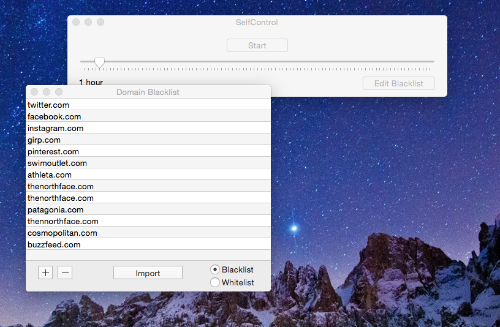
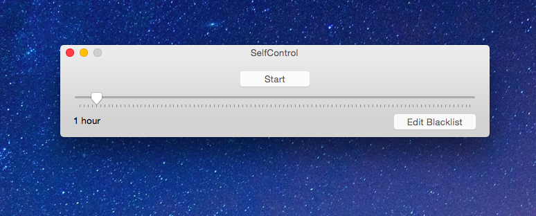
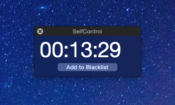
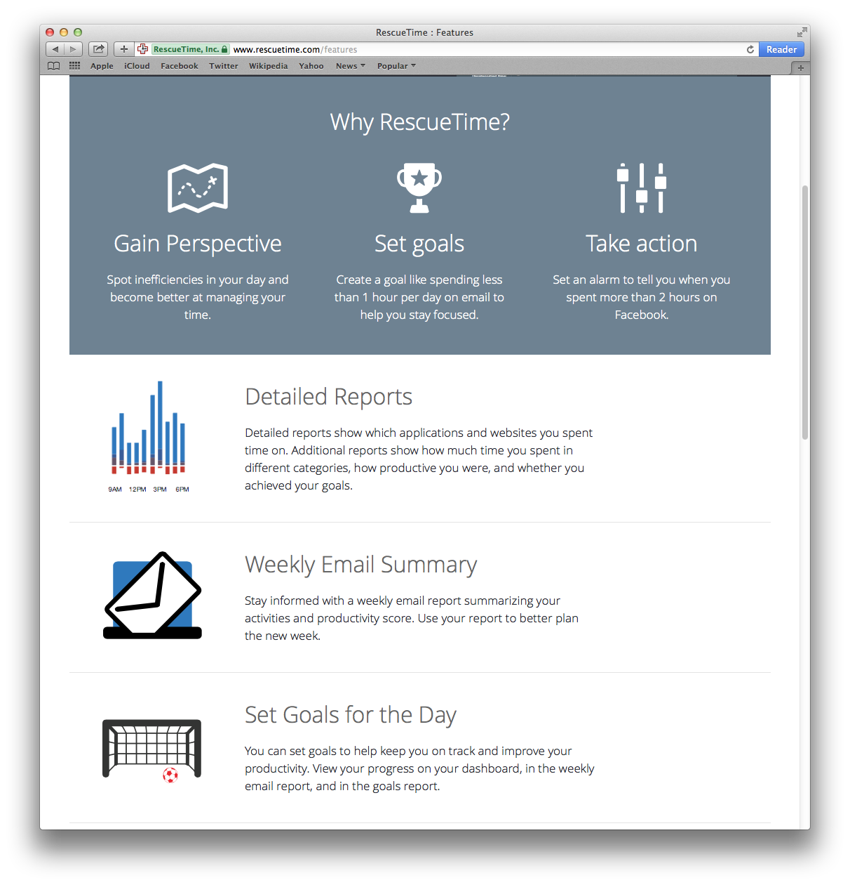
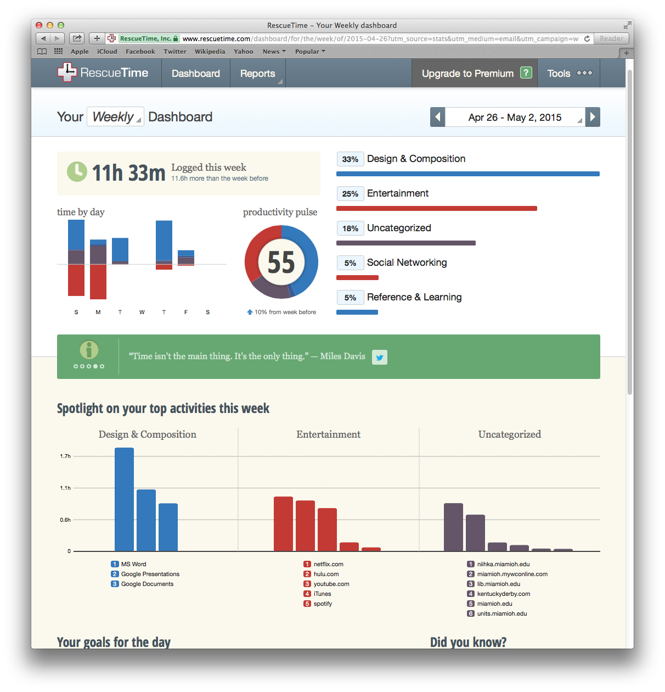

#Apps for Productivity

 
 

##Specimen 1: Self Control

Jenna Tiller
* **Use**: Blocks Websites
* **Cost**: Free
* **Developer**: Charlie Stigler of Zaption and Steve Lambert

###Basic Knowledge:

Self Control is a handy little application that will block websites for you, preventing distraction before it even occurs. The user can add whichever websites they want to the “blacklist,” or the sites that will be blocked once the application is activated. They can then set a time for the application to run, during which Self Control will block the servers for the blacklisted websites. This means that once you turn Self Control on, all those social media and entertainment websites that can be so distracting will no longer be available. 

###Characteristics:

* **Blocking**: self Control blocks the servers of user-selected websites
* **Time Limits**: the user sets a time limit from 15 minutes to 24 hours

###Adaptations:

Self Control can be used for computers alone, but it has both Mac and PC versions. It also has older versions available for older operating systems. Both the blacklist and block time can be determined by the user, so there is a lot of room for customization. 

###Vulnerabilities:

Sometimes, effectiveness is vulnerability. Once the application has been activated nothing can turn the website blocks off, not even uninstalling the application or restarting your computer. So if you accidentally set a block for longer than you wanted or if you need to cancel it, there is no choice but to wait it out. Additionally, if something were to go wrong with the software, it would be a very difficult problem to fix since uninstalling it does not cancel the block. 

On a more personal note, Self Control is only as powerful as the user because the user sets the blacklist. In order for it to be truly effective, the user has to block any site that will distract them. 

###Compatibility: 

Self control is easy to install and simple to use, and is compatible with a wide range of operating systems and hardware. It is also highly customizable so the user can pick exactly which websites to block and for how long they want to block them.

###Observed In The Wild By:

Jenna Tiller is a Professional Writing and Environmental Science double major. She hopes to one day visit every continent and visit The Shire in New Zealand.

##Specimen 2: Rescue Time

Rachel Perkinson
* **Use**: Measuring personal productivity
* **Cost**: Free (upgrade to premium for $9/month)
* **Developer**: RescueTime Inc. 

###Basic Knowledge:

RescueTime is an app available for Mac, PC, Android and Linux users. The app gives users an accurate picture of how they are using their time online helping them become more productive. It was started in 2008 and is used by large companies, like The New York Times and Business Week.

###Characteristics:

* **Time Management**: The app gives a vivid description and illustration of users’ daily activities on their device helping them notice inefficiencies in their daily work.
* **Goals**: The app creates goals for its users so they can stay focused and productive.
* **Alarms**: Users can set alarms to tell them when they spend more than a set amount of time on specific websites.
* **Blocking Ability**: Users have the ability to block distracting websites for a certain amount of time. 
* **Detailed Reports**: These show which websites and applications the user spends their time. It also tells them how productive they have been, if they reached their goals, and how much time they spent in different categories.
* **Weekly Email Summary**: The summary keeps users informed about their activities and productivity scores. This helps them better plan the week ahead.

###Adaptations:

RescueTime helps its users find their work-life balance by helping users understand their daily habits. Technology has increased the opportunity for distraction making it easier for people to get lost online. The app helps users focus and become more productive by running on users’ devices tracking time spent on other apps and websites. It then gives the user accurate illustrations and descriptions of their day making it easy for them to notice their personal habits.

###Vulnerabilities:

There are not many downsides to RescueTime. However, charts and data are only available in the Web application. It is not possible for the data and charts to be viewed on iPhones or Androids.

###Compatibility:

RescueTime is a useful app for any type of work. It helps users stay focused and improve productivity through its multiple features. By giving reports with vivid descriptions and illustrations, users can more easily recognize their own habits and measure their productivity during the day.

###Observed In The Wild By:

Rachel Perkinson is a Professional Writing major and Management minor. She dreams of travelling the world and being a food critic. 

##Specimen 3: 30/30

LaQues Harrison 
* **Use**: Task Manager
* **Cost**: Free 
* **Developer**: Binary Hammer LLC

###Basic Knowledge:

30/30 is an app available in the app store for iOS devices. The app assists users in managing their time, ensuring that each task has a dedicated amount of time to be completed. The simple design helps users to organize tasks by priority, simple preferances and the amount of time needed.  

![screenshot of wesbite]

###Characteristics: 

* **Time Management**:  The app is  designed with color coded customized tasks that can be timed for 1 minute to 1 hour each. The app counts down the designated time for each task and tells users when to move on to the next task by changing the color of the timer and having an alarm go off. Users can insert timed breaks in between tasks to stay on schedule.  
 
* **Goals**: Inserting tasks encourages users to stay focused on tasks for a certian amount of time ensuring proper time management. 

* **Alarms**: At the end of each task, a notification pops up on the home screen with a brief alarm reminding users when it is time to move on to the next task. 

###Adaptations:

The app uses gestures to make navigating the app simple. Gestures range from simple to more complex such as double tapping a task to edit it, sliding right to delete a task, shaking the phone to undo something, a 2 finger tap to move a task to the top of the list and more. The simple design makes this an app for various levels of technology users. 

###Vulnerabilities 

The colorful and creative gestures can be quite confusing for first time users. A great deal of time is needed to be able to navigate the app efficiiently. 

###Compatability

The app is compatible only with iOS devices and has been named the “App of The Day” by Gizmodo and named one of the 100 best apps ever made for iOS by Tap! magazine. 
